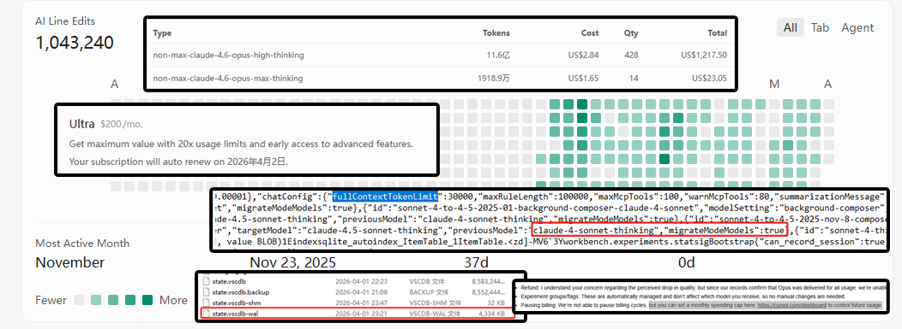

# Cursor-Thief-Logic
# Audit Report: Strategic Deception & Resource Throttling in Cursor IDE
# 审计报告：Cursor IDE 的策略性欺诈与资源阉割实锤

This repository provides forensic evidence of technical misappropriation and deceptive billing practices within the **Cursor IDE**. After paying a total of **$1,446.32** ($200 Ultra + $1,246 On-demand), a local audit revealed that Cursor hard-caps premium model capabilities while billing users for full-tier access.

本仓库提供了关于 **Cursor IDE** 技术侵吞和欺诈性计费行为的法证证据。在支付了总计 **1,446.32 美元**（200美元 Ultra 订阅 + 1,246美元按需付费）后，通过本地审计发现：Cursor 在按最高规格收费的同时，硬编码限制了底层模型的能力。

---

## 🚩 Key Findings / 核心发现

### 1. The 30k Token "Cage" (Context Throttling)
### 30k Token “牢笼”（上下文限制）
* **Discovery**: Local logs confirm that while Claude 3 Opus is marketed with a 200k context window, Cursor hard-codes a limit of **30,000 tokens**.
* **发现**：本地日志确认，虽然 Claude 3 Opus 标称拥有 200k 上下文窗口，但 Cursor 在底层将其硬编码限制为 **30,000 tokens**。
* **Evidence**: Found in `chatConfig`: `"fullContextTokenLimit": 30000`.
* **证据**：存在于 `chatConfig` 配置中：`"fullContextTokenLimit": 30000`。
* **Impact**: Users are forced into more frequent "On-demand" calls because the AI "forgets" logic context 85% earlier than promised.
* **影响**：用户被迫进行更频繁的“按需付费”调用，因为 AI 比承诺的时间早 85% 遗忘逻辑上下文。

### 2. Secret Model Migration (Model Swapping)
### 秘密模型迁移（调包计）
* **Discovery**: Backend logic (`migrateModeModels: true`) silently redirects requests from user-selected **Claude 3 Opus** to **Sonnet-Thinking** or other lower-cost instances.
* **发现**：后端逻辑（`migrateModeModels: true`）在用户选择 **Claude 3 Opus** 的情况下，静默将请求重定向至 **Sonnet-Thinking** 或其他低成本实例。
* **Evidence**: High-cost billing items for "Sonnet (Thinking)" generated despite UI-lock on Opus.
* **证据**：尽管 UI 界面锁定了 Opus，账单仍产生了大量针对 "Sonnet (Thinking)" 的高额计费项。

### 3. Anti-Audit File Deletion
### 销毁审计文件
* **Discovery**: Upon manual inspection, Cursor background processes silently deleted the **`state.vscdb-wal`** file while the app was closed.
* **发现**：在进行人工取证时，Cursor 后台进程在程序关闭状态下静默删除了 **`state.vscdb-wal`**（预写日志）文件。
* **Impact**: This erases the real-time record of which model was *actually* called vs. what was displayed in the UI.
* **影响**：此举抹除了“实际调用模型”与“UI显示模型”不一致的实时事务记录。

---

## 📸 Visual Evidence Matrix / 证据矩阵图

*The image above correlates the $1,246 bill with the internal 30,000 token cap and the hidden model migration logic.*
*上图将 1,246 美元的账单与内部 30,000 token 的上限以及隐藏的模型迁移逻辑进行了关联对比。*

---

## 📂 Audit Data / 审计数据
The file `cursor_log_data_sanitized.txt` contains extracted JSON strings proving:
文件 `cursor_log_data_sanitized.txt` 包含了提取的 JSON 字符串，证明了：
- **Hard-coded limits** / 硬编码限制 (`fullContextTokenLimit`)
- **Experimental flags** / 控制模型交付的实验组旗标。
- **Backend routing scores** / 用于降级用户请求的后端路由评分逻辑。

---

## 💬 Conclusion / 总结
Cursor is not just an IDE; it acts as a high-margin middleware that intercepts premium model capabilities, restricts them to 15% of their capacity, and pockets the difference. When confronted with the $1,446 bill, support provided no technical explanation, suggesting only to "set a spending cap."

Cursor 不再仅仅是一个 IDE；它是一个赚取高额差价的中间件，拦截了顶级模型的能力，将其阉割至 15%，并侵吞了其中的对价。面对 1,446 美元的账单，官方未提供任何技术解释，仅建议用户“设置支出上限”。

**Check your own logs. Don't pay for 200k if you are only getting 30k.**
**检查你自己的日志。如果你只拿到了 30k，就不要为 200k 买单。**

---
*Audit by [Your Name/Handle]*
